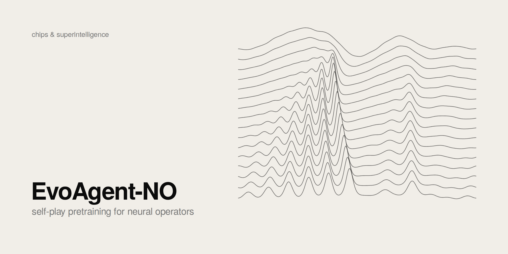
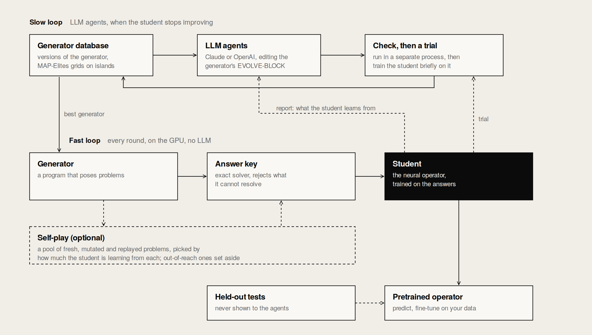
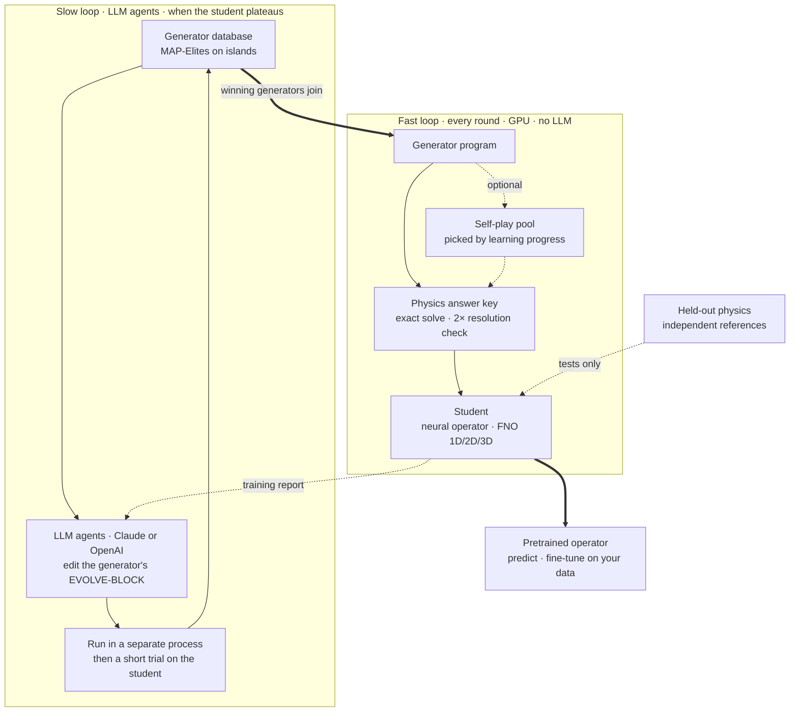

<picture>
  <source media="(prefers-color-scheme: dark)" srcset="assets/banner-dark.png">
  
</picture>

# EvoAgent-NO

**LLM Agents + Neural Operators + Self-Play.** Pretrain neural operators with zero data. Inspired by [AlphaEvolve](https://deepmind.google/discover/blog/alphaevolve-a-gemini-powered-coding-agent-for-designing-advanced-algorithms/).

How do you pretrain a neural operator when you have no data? The usual answer is to run a solver
in advance over a fixed family of PDEs, parameters and initial conditions, and train on whatever
comes out. Someone has to choose those problems before training starts, and the operator never gets
a say in what it learns next.

EvoAgent-NO lets the system choose. A small program poses physics problems, an exact solver answers
them, and the neural operator (we call it the student) trains on the answers. When the student
stops improving, LLM agents rewrite the program that poses the problems, and a rewrite stays only
if a short trial shows the student learns more from it. You write a first version of the program;
it does not need to be good. Nothing is downloaded. Optionally, self-play also picks the problems
within each round.

EvoAgent-NO is open source (Apache-2.0) and comes from [Chips & Superintelligence Labs](https://chipsuperintelligence.com).

## Architecture overview

<p align="center">
  <picture>
    <source media="(prefers-color-scheme: dark)" srcset="assets/figures/architecture-dark.png">
    
  </picture>
</p>
<p align="center"><em>Figure 1: The two loops. The fast loop trains the student every round without any LLM. The slow loop rewrites the problem generator when the student stops improving. Self-play within the fast loop is optional.</em></p>

<details>
<summary>The same diagram as text (Mermaid)</summary>



</details>

### The fast loop

- **Generator.** A Python program with two functions, `generate_problems(rng, n)` and
  `mutate_problem(problem, rng)`. It decides which PDEs, coefficients and initial conditions exist.
  You write the first version; the agents rewrite it.
- **Answer key.** An exact solver on the GPU. It solves every problem twice, at two resolutions,
  and drops any problem it cannot answer reliably: blow-ups, and anything the two solutions
  disagree on. The student is never graded against a wrong answer.
- **Student.** A Fourier neural operator in 1D, 2D or 3D. It sees input fields and predicts the
  output field, without being told which equation produced them. It is the only part that trains,
  and it is what you keep at the end.

### The slow loop

- **Generator database.** Every version of the generator the agents have written, kept in
  MAP-Elites grids on a few islands. A version's cell depends on how many kinds of problem it
  covers and how many the answer key accepts.
- **LLM agents.** Claude or an OpenAI model. An agent gets the physics description, a parent
  generator, a few others for ideas, and a report of what the student has been learning from. It
  replies with SEARCH/REPLACE edits to the generator's EVOLVE-BLOCK. It never sees held-out scores.
- **Check, then a trial.** Each edit runs in a separate process with a time limit and must produce
  well-formed problems. Then comes a short trial: the student trains on half of the new generator's
  problems for one round, and the score is how much error that removed on the other half. The
  student is then put back as it was.
- **What the student trains on.** Your generator, always, plus every rewrite that beat it in the
  latest trial, in equal shares. A rewrite adds to what the student sees; it never replaces yours.
- **When to call the LLM.** Only when the student has stopped improving on the current
  curriculum. While it is still learning, a check costs nothing.

### Self-play (optional)

With `--selfplay`, a pool picks each round's problems instead of taking the generator's as they
come, as in the self-play paper: fresh ones, mutations of problems the student is learning from
fastest, and replays with new random fields, kept in a MAP-Elites grid so the curriculum cannot
collapse onto one kind of physics. "Learning from fastest" is the learning-progress reward of
Cowsik et al., computed for the whole batch in one forward-mode pass. Problems far harder than the
generator's typical one (a loss more than `too_hard` = 4 times the median of the round's fresh
problems) are set aside as out of reach.

## Key ideas

### Measure a new generator, do not extrapolate

Learning progress looks along the direction the student has been moving. That is what the self-play
paper uses to rank problems, and it works inside a round. It cannot see physics the student has
never trained on, which is exactly what a new generator is for. So a candidate generator gets a
short trial instead: the student trains on half of its problems, and the score is how much error
disappeared on the other half. Problems the student has mastered score near zero, and so do trivial
ones.

### Add, do not replace

Without data there is no direct measure of what we want, a student that generalizes to physics it
has not seen; the trial is a stand-in. So a rewrite that wins its trial joins your generator
instead of replacing it, and the student keeps training on what you wrote. A misleading trial can
cost at most its share.

### The fitness moves

A generator's score is measured on the current student, and the student keeps learning, so scores
go stale. They fade every step, and your generator and the strongest rewrites are measured again
before the agents see them. This is the main difference from evolving programs against a fixed
evaluator: here the evaluator is learning too.

### An answer key that says no

Every problem is solved twice, at N and 2N points (or cells), and kept only if the two answers
agree and nothing blew up. A problem where nothing evolves (every term zero) is refused outright.
Held-out tests use references from other methods (exact and manufactured solutions, Cole–Hopf,
SciPy), so the test never shares the solver's own errors.

### Telling the student what the physics guarantees

A backend describes its samples to the student in a small `IO` dictionary: which channels share a
normalization, whether the output is a change from an input, and which symmetries hold. For steady
diffusion, −∇·(a∇u) = f, doubling f doubles u and scaling a scales u inversely; the student is
built so that its answer scales the same way, exactly, whatever the size of f and a.

## Getting started

```bash
pip install git+https://github.com/chipsuperintelligence/EvoAgent-NO      # or, from a clone: uv sync
pip install "evoagent-no[openai] @ git+https://github.com/chipsuperintelligence/EvoAgent-NO"   # + OpenAI backend
```

Python 3.10+, PyTorch 2.4+. A GPU is recommended; everything also runs on the CPU, slowly. For the
agents, sign in to the Claude Code CLI once (`claude auth login`) or configure an OpenAI key.

```bash
evoagent-no new                               # list templates
evoagent-no new pde1d tasks/my-pde            # a task folder from a template
evoagent-no check tasks/my-pde                # wired up? seconds
evoagent-no quick tasks/my-pde                # agents vs baseline, small: a few minutes, 2 LLM calls
```

A full run, then the pretrained student on your own data:

```bash
evoagent-no run tasks/my-pde                        # agents evolve the generator; checkpoints as it goes
evoagent-no run tasks/my-pde --no-agents            # the baseline: the generator as written, same compute
evoagent-no run tasks/my-pde --selfplay             # optional: self-play picks each round's problems too
evoagent-no run tasks/my-pde --resume --rounds 400  # continue a stopped run, or extend a finished one
evoagent-no report runs/my-pde/agents-s0            # held-out curve, training, every agent attempt
evoagent-no compare runs/my-pde/*/
evoagent-no finetune runs/my-pde/agents-s0 --data mine.npz   # arrays `inputs`, `targets`
evoagent-no predict runs/my-pde/agents-s0 --inputs x.npy --out y.npy
```

The same from Python:

```python
import evoagent_no as evo

evo.run("tasks/my-pde", "runs/my-pde/agents-s0")      # agents=False: baseline; selfplay=True: add self-play
student = evo.load_student("runs/my-pde/agents-s0")
prediction = student.predict(inputs)              # (samples, channels, *space), numpy in and out
student.finetune(my_inputs, my_targets, steps=500)
student.save("runs/my-pde/finetuned")
```

Two templates, deliberately different, run on the same core:

| Template | Problem | Student sees → predicts | Answer key |
|---|---|---|---|
| `pde1d` | 1D PDEs from nine terms, periodic | 4 frames → the next frame (time stepping) | Spectral ETDRK4, checked at 2× resolution |
| `elliptic2d` | −∇·(a∇u) = f on the unit square, u = 0 on the boundary | (log a, f) → u (an operator, no time) | Batched conjugate gradient, checked at 2× resolution |

## Your own problem

Everything about one problem domain lives in one folder: the program that poses problems, the
physics that answers them, and the settings. The [tutorial](docs/TUTORIAL.md) walks through one.
[`examples/transport1d`](examples/transport1d) (1D) and [`examples/heat3d`](examples/heat3d) (3D)
are complete tasks with their own physics to start from; [`examples/broad-guess`](examples/broad-guess)
and [`examples/heat-only`](examples/heat-only) reuse the built-in physics with a different generator.

| File | What it holds | Who edits it |
|---|---|---|
| `task.yaml` | Physics backend, held-out tests, student size, run length, agent and LLM settings. Missing keys take defaults | You |
| `generator.py` | `generate_problems(rng, n)` and `mutate_problem(problem, rng)` between `EVOLVE-BLOCK` markers | You write the first version; the agents rewrite the block |
| `context.md` | What the agents are told about the physics | You |
| `physics.py`, `heldout.py` | Optional: your own answer key and tests, if `task.yaml` points at them | You |

A physics backend is a module with five things:

```python
Problem                        # a frozen dataclass: one problem
IO = {"dims": 2, "in_channels": 2, "out_channels": 1,   # what a sample looks like
      "norm_groups": [[0], [1]], "residual": None, "scale": (1, "rms"), "periodic": False}
check(problem)                 # raise ValueError if malformed; guards against bad generator code
describe(problem) -> tuple     # its MAP-Elites cell, so the curriculum keeps its coverage
solve(problems, device) -> Samples(inputs, targets, problem, accepted)
```

`inputs` is `(M, in_channels, *space)` and `targets` is `(M, out_channels, *space)` on a regular grid
in 1D, 2D or 3D, so time stepping (frames in, next frame out) and operators (fields in, solution out)
both fit. The student is built from `IO`, so a new backend needs no model code. A held-out module has
`build(count, device) -> {family: (inputs, targets)}`, with references from a different method than
your solver. See [`physics/__init__.py`](src/evoagent_no/physics/__init__.py) for the full contract.
Irregular geometry (meshes, point clouds) is not supported yet; it needs a different kind of student.

## The LLM: its role, its cost, and how to control it

**Role.** The LLM only works in the slow loop, and only on code. It does not solve physics, train
the student, score its own edits, run code or touch files: EvoAgent-NO applies its edits, runs the
result in a separate process, and measures it on the student.

**Backends.**

| Backend | Status | Default |
|---|---|---|
| `claude-cli` | Ready; checked live | Claude Sonnet 5 (`claude-sonnet-5`), effort `medium` |
| `openai` | Ready; tested with a stand-in client only | none: name the model; `base_url` for OpenAI-compatible endpoints; `uv sync --extra openai` |

`claude-cli` runs the Claude Code CLI with your own login, so calls count against your Claude plan,
not API credit (unless `ANTHROPIC_API_KEY` is set in the shell). Each call is a single, tool-free
completion: `--tools ""` (nothing to approve, no agent loop), our own short system prompt, no MCP
servers, and an empty working directory so no project CLAUDE.md is loaded. It runs unattended.

**Model and reasoning.** Any model the backend accepts, any effort level:

```yaml
agents:
  llm:
    backend: claude-cli
    model: claude-opus-5          # or claude-sonnet-5, claude-fable-5-1, ...
    effort: high                  # low | medium | high | xhigh | max; null for the model's default
    budget_usd: 1.0               # cap per call
```

A list mixes models by weight, for example mostly a fast setting with a stronger one now and then:

```yaml
  llm:
    - {backend: claude-cli, model: claude-sonnet-5, effort: low, weight: 0.7}
    - {backend: claude-cli, model: claude-opus-5, effort: high, weight: 0.3}
```

`evoagent-no llm check --model claude-opus-5 --effort high` tries a setting.

**How many calls.** `agents.candidates` per evolution step. Every `agents.every` rounds the run
checks whether a step is worth it; with `trigger: plateau` (the default) it evolves only when the
student has stopped improving. With the defaults (2 candidates, a check every 20 rounds), a
200-round run makes at most 18 calls, usually fewer; `quick` makes 2; with `--no-agents`,
none. A Sonnet 5 call at medium effort takes 25–70 s and costs $0.04–0.12 at API prices, more
when it rewrites the whole generator.

**Spending less.**

| What | How |
|---|---|
| Evolve only when needed | `trigger: plateau` (default): a step runs only when the student's training loss improved by less than `min_improvement` (5%) over the last `every` rounds, measured after the last step. `trigger: every` evolves at every check |
| Fewer, smaller calls | `candidates`, `every`, `effort: low`; edits are SEARCH/REPLACE, not whole files |
| Cheaper models for most calls | a weighted list, as above |
| Prompt caching | prompts put the parts that never change (physics, reply format, rules) first, so providers can serve them from cache; `evoagent-no report` shows how many input tokens came from cache. Calls in the same step start together and rarely share a cache entry: `parallel: 1` lets later calls reuse the first one's prefix, at the cost of a longer step |
| No wasted measurements | a reply that reproduces an existing generator is dropped before validation and before the GPU probe |
| A hard ceiling | `budget_usd` per call |

## Repository layout

```
src/evoagent_no/
  task.py       loads a task folder
  problems/     generator programs (EVOLVE-BLOCK, sandboxed validation) and the pool
  physics/      answer keys; pde1d and elliptic2d built in
  student/      the neural operator (an FNO in 1D, 2D or 3D, built from the backend's IO), its
                training, and the pretrained student (load, predict, fine-tune)
  score/        learning progress
  agents/       the LLM loop that rewrites generators
  evals/        held-out physics with independent references
  llm/          model backends (Claude via the Claude Code CLI, OpenAI)
  templates/    starting task folders (pde1d, elliptic2d)
examples/       broad-guess, heat-only (other starting generators); transport1d (1D), heat3d (3D)
                with their own physics.py and heldout.py
docs/           TUTORIAL.md (your own problem)
assets/         the banner and the figures in this README, light and dark
csrc/           C/CUDA, added only where profiling shows Python is too slow
```

## License

Apache-2.0.

## Inspired by

- [AlphaEvolve](https://deepmind.google/discover/blog/alphaevolve-a-gemini-powered-coding-agent-for-designing-advanced-algorithms/) (Google DeepMind, 2025): LLMs evolving programs, with an automatic evaluator deciding
  what survives. Here the programs pose problems, and the evaluator is a student learning from them.
- A. Cowsik et al., *Self-Play Pretraining with Zero Data*, arXiv 2609.30063 (2026): the
  learning-progress reward.
